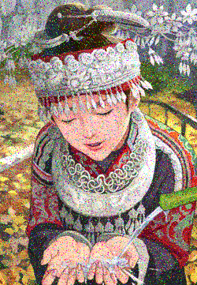

# simply-noise2noise-TF
Implementation of noise2noise but also perform autoencoder or denoising-autoencoder

noise2noise original paper: https://arxiv.org/abs/1803.04189

original implementation: https://github.com/NVlabs/noise2noise

## Usage
put the images in the folder named "data". They are used for training. 
       
put the image in a folder named "val". They are used for validation.

when you set folders, training runs "python main.py". 

after training, test runs "python pred.py" It is executed on the images in the folder named "test". 


like this
```
main.py
pred.py
data
  ├ 000.jpg
  ├ aaa.png
  ...
  └ zzz.jpg
val
  ├ 111.jpg
  ├ bbb.png
  ...
  └ xxx.jpg
test
  ├ 222.jpg
  ├ ccc.png
  ...
  └ yyy.jpg 
```

## Result examples
input


output

